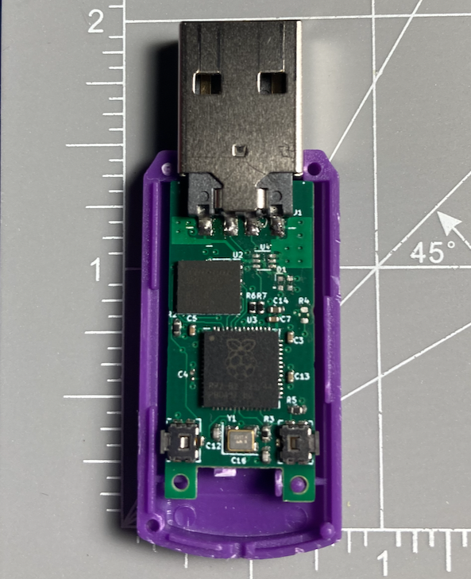

# RP Ducky

A RP2040 based keystroke injector that uses standard [Ducky Script](https://docs.hak5.org/hak5-usb-rubber-ducky/duckyscript-tm-quick-reference). Unlike the original Rubber Ducky from Hak5, this module does not require the scripts to be loaded over an SD card. Instead, you can start the RP Ducky in USB Storage mode to both update the code and the scripts on the device.

## Fabrication

The PCBs are fabricated as a 4 layer board with JLCPCBs JLC04161H-7628A stackup. The bill of materials and the gerber files are available in the [fab](./fab) folder. The USB covering the PCB is designed for can be found on [Alibaba](https://www.alibaba.com/product-detail/Custom-Logo-2-0-3-0_1600456187162.html?spm=a2700.galleryofferlist.p_offer.d_image.72eb3e85w6j8S4&s=p) or on [Amazon](https://www.amazon.ca/RAOYI-Drives-Memory-Storage-Swivel/dp/B07KS1TTCH?ref_=ast_slp_dp&th=1) 

## Usage

To upload the code and scripts to the RP Ducky, you need to put the RP Ducky into USB Storage mode. To do this, hold the button `BOOT` and `RESET` buttons down while plugging the device into a computer. Release the `BOOT` button first and then the `RESET` button. The device will show up as storage device. Copy Adafruit's [Raspberry Pi Pico UF2 Circuit Python file](https://circuitpython.org/board/raspberry_pi_pico/) on to the RP Ducky. You can then copy the contents of [code](./code/) onto the device. To run the test script, copy `sample/payloads/rickroll_macos.txt` to the RP Ducky's root directory and rename it to `payload.txt` 